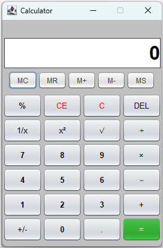

# Practical 3

## Getting Started

*Please ensure you read and understand the entire document before you start to code. If clarification is needed, please
seek this as soon as possible.*

In this practical you will implement a simple GUI calculator. You will begin by defining the layout. Then you will
implement the standard operations. After this you will implement additional mathematical functions and then finally you
will implement the memory functionality of the calculator.

**Failure to comply with the specifications is not acceptable and will incur penalties** (some variation in the
overall size of the calculator maybe necessary due to differing operating systems, but the layout and overall look
must adhere to the specifications.)

## Task 1

1. The first task is to open the `GUICalculator` project. Take the time to become familiar with the existing code.
   The `CalculatorDriver` class contains the necessary instructions to create the `JFrame` and instantiate
   a `CalculatorPanel`. The `ButtonConstants` interface contains constants that can be used for the calculator
   button faces.
2. In the `CalculatorPanel` class you should declare two constant instance variables `CALC_WIDTH` and `CALC_HEIGHT` and
   initialise the values to 265 and 375 respectively.
3. Set the background colour of the `CalculatorPanel` to light grey and set the preferred size to the previously
   defined `CALC_WIDTH` and `CALC_HEIGHT` values. This code should be done in the `init` method which is called from
   the `CalculatorPanel` constructor.
4. Run the `CalculatorDriver` file and confirm that your output resembles    

   

   Now you will implement the label to display the calculator operations and the current calculation.

5. Create a `JLabel` to display the calculator operations. Declare an instance variable of type `JLabel` and call
   it `result`.
6. Within the `init` method set up the `JLabel`. The label should be 5 pixels less than the width
   of `CalculatorPanel` and 50 pixels high. Set the initial text for the `JLabel` to 0.
7. Run the application again and confirm the output. This current output is not appropriate, and we need to modify our
   code to ensure we match our initial example.
8. When creating a `JLabel` we can add extra arguments to our call to the constructor. Currently, we
   use `new JLabel("0")`, however we can use a constant value of the `JLabel` class to define the alignment of
   the `JLabel`.  `JLabel.RIGHT` allows us to set the label to align the string to the right of the label. Using the
   following template implement a right aligned label `new JLabel(text, alignment)`.
9. add a border to the label by using the `setBorder(BorderFactory.createLineBorder(Color.darkGray))` method.
10. Now we need to modify the font size and style for the label. The `JLabel` class contains a method `setFont` that
	accepts a Font object as an actual parameter. To create a new `Font` object you need to supply the font type, style
	and size: `new Font(type, style, size)`

	- *type* - "Arial"
	- *style* - Font.BOLD
	- *size* - 32

11. The next task is to change the background colour of the `JLabel` to white. There is a `setBackground` method for
	the `JLabel` however you also need to set the `JLabel`'s opaque property to true. There is a `mutator` method for
	the `JLabel` class that accepts a `boolean` argument: `setOpaque` to complete this.

12. Now we need to create a label to hold the information for the current calculation.
	1. Create a `JLabel` named `calculation`, with the text set to "", and the alignment right
	2. set the background color to 'lightGray' and the font to "Helvetica", PLAIN, size 12
	3. set the preferred size to `CALC_WIDTH - 5` and a height of 20

The following screenshot shows how the labels should look (without the red border) and where they will be
positioned in the final layout.  

## Task 2

1. With the labels defined you need to start adding the buttons. The most direct way is to create a `JButton` array
   for the 29 buttons that are on the calculator. You may also create a matching `String` array to hold the text
   that will appear on the buttons... you can use the constants in the `ButtonConstants` interface for some and
   literal text for the rest.
2. Create a *private inner class* called `ButtonListener` that implements the `ActionListener` interface. Define
   the `actionPerformed` method with an empty body, you will complete it later.
3. Once you have the two arrays and the listener class you can use a for loop to traverse the button array and set up
   each button.
	1. The default size of the buttons is 65 x 40, using "Helvetica", size 13, PLAIN font with foreground `darkGray`
	2. add the action listener to each button using the `addActionListener(new ButtonListener())` method
	3. For the memory buttons the dimensions are 48 x 30, using "Helvetica", size 12, PLAIN font with a background
	   color of `lightGray`
	4. <kbd>C</kbd> and <kbd>CE</kbd> have a foreground of Red
	5. the numeric buttons have a bold font of size 13
	6. The <kbd>=</kbd> button foreground color is green. (I used r = 0.13f, g = 0.55f, and b = 0.13f)
4. Create a `JPanel` named `memoryPanel`, set the background to `lightGray`and its layout to a `GridLayout` with 1
   row, 1 column, horizontal and vertical gaps of 1.
5. Create a `JPanel` named `calcPanel` with color `lightGray`, an empty border with 2 pixel insets, and a
   `GridLayout` with 7 rows, 4 columns, and horizontal and vertical gaps of 1
6. Add the memory buttons to the `memoryPanel1
7. Add the remaining buttons to the `calcPanel`
8. Now add (in the order listed) each component to the frame:
	1. `calculation` label
	2. `result` label
	3. `memoryPanel`
	4. `calcPanel`

The following screenshot shows how the memory and calc panels should look (without the red border) and where they
will be positioned in the final layout.  

## Task 3

For this task you are required to implement the initial functionality of the calculator's standard operations -- `+`,
`-`, &times;, and &divide;

1. You will complete the `actionPerformed` method in the `ButtonListener` class, so you will need to retrieve the label
   from the `JButtons` to determine what action to perform. To retrieve the label you can retrieve one of the properties
   of
   the `ActionEvent` object. By using the `getActionCommand` method you can retrieve the label as a `String`. Once you
   have that string, you can use a switch determine what action to perform.
2. Use a series of selection statements to respond appropriately to the button presses. When a number is pressed first,
   you need to display it on the label. The next time you press a number button append the new number to the end of the
   label text. Continue this process with each number button press.

   *What happens if the number displayed is 0?*

3. When an arithmetic operator is pressed, retrieve the `String` from the `JLabel`, *parse* it to a `double` value and
   assign it to a variable `num1`. Consult the Java API to work out how to convert a String to a double.

   **Hint**: *use the same structure as when we convert a String to an integer*.
4. You should retrieve the operator and store it in a `String` variable `op`.
5. Follow the same procedure as before to input the second number. When the user presses the equals button retrieve
   the `String` from the label and assign the `double` to a variable `num2`. Calculate the result and display it on
   the `JLabel`.
6. To complete the calculation define a private `double` method called `calculate` that accepts 3
   parameters `(String op, double num1, double num2)`. Use a `switch` statement to determine what operation to do and
   then return the result from the calculation.
7. If the use presses the <kbd>DEL</kbd> key then you should remove the last digit on the display. If you remove all
   digits then the display should read '0'
8. Finally, if the user presses the <kbd>C</kbd> or <kbd>CE</kbd> button then set `num1` and `num2` to 0 and set
   the text of the `JLabel` to 0.

## Task 4

For this task you need to implement the remaining mathematical functions.

1. add more cases to your switch statement to achieve this

Examples of output for some calculations:

| Key strokes                                                             |        | Result                                    |
|-------------------------------------------------------------------------|--------|-------------------------------------------|
| <kbd>4</kbd> <kbd>+</kbd> <kbd>5</kbd> <kbd>=</kbd>                     | &rarr; |                |
| &rarrhk; <kbd>&times;</kbd> <kbd>6</kbd> <kbd>=</kbd>                   | &rarr; |               |
| <kbd>8</kbd><kbd>5</kbd> <kbd>&radic;</kbd>                             | &rarr; |          |
| <kbd>2</kbd><kbd>5</kbd> <kbd>&radic;</kbd>                             | &rarr; |          |
| <kbd>2</kbd><kbd>5</kbd> <kbd>x&sup2;</kbd>                             | &rarr; |              |
| &rarrhk; <kbd>&radic;</kbd>                                             | &rarr; |  |
| &rarrhk; <kbd>1/x</kbd>                                                 | &rarr; |           |
| <kbd>8</kbd> <kbd>+</kbd> <kbd>5</kbd> <kbd>%</kbd> <kbd>=</kbd>        | &rarr; |        |
| <kbd>8</kbd> <kbd>-</kbd> <kbd>5</kbd> <kbd>%</kbd> <kbd>=</kbd>        | &rarr; |       |
| <kbd>8</kbd> <kbd>&times;</kbd> <kbd>5</kbd> <kbd>%</kbd> <kbd>=</kbd>  | &rarr; |       |
| <kbd>8</kbd> <kbd>&divide;</kbd> <kbd>5</kbd> <kbd>%</kbd> <kbd>=</kbd> | &rarr; |      |

## Task 5

The final task is to implement the memory button operations.

1. When the user presses the memory store button <kbd>MS</kbd> you should set value of `memory` to value currently
   displayed and overwrite any existing memory value.
2. When the user presses the memory plus button <kbd>M+</kbd> you should add the current value of the `JLabel` to a
   `double` variable `memory`. Every press of the memory plus button should add the value to the current value
   of `memory`.
3. When the user presses the memory minus button <kbd>M-</kbd> you should subtract the current value of the `JLabel`
   from the `double` variable `memory`.
4. When the user presses the memory recall button <kbd>MR</kbd> you should display the current value of `memory` on
   the `JLabel`.
5. When the user presses the memory clear button <kbd>MC</kbd> you should set the value of `memory` to 0.